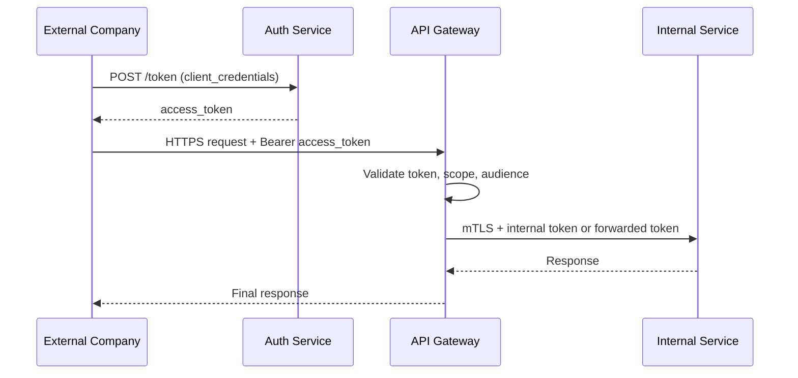
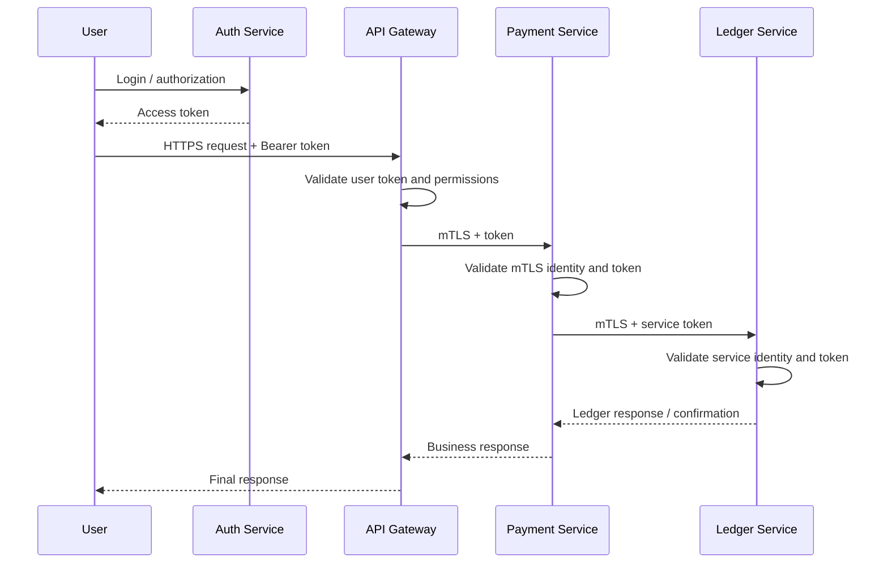
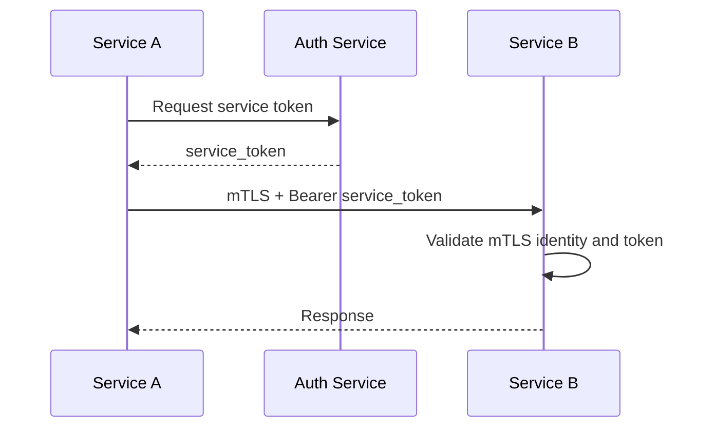

# Enterprise Open Platform Security Design

This document describes a secure and transparent design for an **enterprise financial application** that exposes an **open platform** to external companies and also uses internal microservices. The recommended model is: **OAuth2 at the edge, mTLS inside, JWT for authorization, and token exchange where needed**. [nvlpubs.nist](https://nvlpubs.nist.gov/nistpubs/SpecialPublications/NIST.SP.800-228.pdf)

---

## 1. Goals

The platform should support three things at the same time:

- **External partners** must integrate safely through public APIs.
- **End users** must authenticate and access only what they are allowed to use.
- **Internal services** must communicate securely with strong service identity and least privilege. [ibm](https://www.ibm.com/think/topics/api-authentication)

For a financial system, security should be built around **zero trust**: every request is authenticated, authorized, and logged, even inside the cluster. [redhat](https://www.redhat.com/en/blog/service-mesh-mtls)

---

## 2. Recommended architecture

Use these layers:

- **API Gateway** as the single public entry point.
- **Authorization Server / Auth Service** for OAuth2 and token issuance.
- **Service Mesh or mTLS layer** for internal service-to-service encryption and identity.
- **Internal microservices** that validate tokens and enforce domain-level permissions. [apiacademy](https://apiacademy.co/2020/04/api-management-for-microservices/)

A practical rule is:

- **External access**: OAuth2 / OIDC.
- **Internal transport**: mTLS.
- **Authorization**: JWT claims and scopes.
- **Sensitive hop-to-hop calls**: token exchange if needed. [docs.cidaas](https://docs.cidaas.com/guides/authentication-authorisation/oauth2/oauth2Flows/tokenexchange/)

---

## 3. Why this design

This design is a good fit for finance because it separates concerns clearly:

- OAuth2 handles **who can call your platform** from the outside. [digitalocean](https://www.digitalocean.com/community/tutorials/an-introduction-to-oauth-2)
- mTLS handles **which internal service is really calling** another service. [ibm](https://www.ibm.com/think/topics/api-authentication)
- JWT handles **what the caller is allowed to do**. [nvlpubs.nist](https://nvlpubs.nist.gov/nistpubs/SpecialPublications/NIST.SP.800-228.pdf)
- Token exchange gives you **least privilege** when a downstream service should not receive the original token. [docs.cidaas](https://docs.cidaas.com/guides/authentication-authorisation/oauth2/oauth2Flows/tokenexchange/)

This is safer than relying only on API keys or only on forwarded tokens. [digitalocean](https://www.digitalocean.com/community/tutorials/an-introduction-to-oauth-2)

---

## 4. External company flow

External companies should not call internal services directly. They should use OAuth2 with the API Gateway only. [digitalocean](https://www.digitalocean.com/community/tutorials/an-introduction-to-oauth-2)

### Scenario

1. The external company registers as an OAuth2 client.
2. It receives a `client_id` and `client_secret`, or stronger credentials like certificate-based client auth.
3. It requests an access token from your Auth Service.
4. It calls your API Gateway with `Authorization: Bearer <access_token>`.
5. The Gateway validates the token, checks scopes, rate limits, and routes the request to internal services. [nvlpubs.nist](https://nvlpubs.nist.gov/nistpubs/SpecialPublications/NIST.SP.800-228.pdf)

### Sequence diagram

The key point is that the partner never sees internal services and internal services never need to be public. [ibm](https://www.ibm.com/think/topics/api-authentication)

---

## 5. User flow

For end users, the flow is similar but user-centered.

1. The user logs in through your identity provider.
2. The user receives an access token.
3. The user sends requests to the API Gateway with that token.
4. The Gateway validates the token and checks user permissions.
5. If authorized, the Gateway forwards the request to internal services over mTLS. [digitalocean](https://www.digitalocean.com/community/tutorials/an-introduction-to-oauth-2)

### Sequence diagram

For user calls, the internal service should validate the token claims that matter to its business logic, such as `aud`, `scope`, `roles`, and expiry. [apiacademy](https://apiacademy.co/2020/04/api-management-for-microservices/)

---

## 6. Service-to-service flow

Internal microservices should talk to each other over **mTLS**. That gives both encryption and service identity. [redhat](https://www.redhat.com/en/blog/service-mesh-mtls)

### Recommended rule

- Each service has its own identity.
- Each service gets its own service token when it needs to call another service.
- The receiving service validates the mTLS identity and the token claims. [docs.cidaas](https://docs.cidaas.com/guides/authentication-authorisation/oauth2/oauth2Flows/tokenexchange/)

### Sequence diagram

This is especially useful in finance because it reduces the chance that one compromised service can impersonate another without detection. [redhat](https://www.redhat.com/en/blog/service-mesh-mtls)

---

## 7. Forward token or exchange token

For your platform, both patterns can exist.

### Forward the user token

Use this when downstream services need the **original user context** and the user permissions must stay visible end-to-end. [nvlpubs.nist](https://nvlpubs.nist.gov/nistpubs/SpecialPublications/NIST.SP.800-228.pdf)

### Token exchange

Use this when you want a **new token** with a different audience, reduced scope, or a more explicit delegation boundary. [docs.cidaas](https://docs.cidaas.com/guides/authentication-authorisation/oauth2/oauth2Flows/tokenexchange/)

### Practical guidance

- Use **forwarding** for simple user-driven business flows.
- Use **token exchange** for highly sensitive flows, partner boundaries, or when downstream services should not trust the original token directly. [nvlpubs.nist](https://nvlpubs.nist.gov/nistpubs/SpecialPublications/NIST.SP.800-228.pdf)

---

## 8. Security responsibilities by layer

### API Gateway

- Validates OAuth2 tokens.
- Enforces coarse permissions and scopes.
- Rate limits and applies WAF rules.
- Hides internal services from the public internet. [apiacademy](https://apiacademy.co/2020/04/api-management-for-microservices/)

### Auth Service

- Issues tokens.
- Rotates signing keys.
- Supports OAuth2 / OIDC flows.
- Optionally supports token exchange. [digitalocean](https://www.digitalocean.com/community/tutorials/an-introduction-to-oauth-2)

### Internal services

- Validate token claims they rely on.
- Trust only mTLS connections from approved internal identities.
- Enforce business-level authorization at the domain boundary. [ibm](https://www.ibm.com/think/topics/api-authentication)

---

## 9. Best practice summary

For your financial open platform, the best design is:

- **OAuth2/OIDC for external partners and users**.
- **API Gateway as the only public API entry**.
- **mTLS for all internal communication**.
- **JWT validation in gateway and services**.
- **Token exchange only where needed**.
- **Short-lived tokens, strong scopes, and audit logging**. [redhat](https://www.redhat.com/en/blog/service-mesh-mtls)

This gives you a secure, scalable platform without forcing every internal service to be public-facing.

---

## 10. Clear request flows

### Another company

- Partner authenticates with OAuth2.
- Partner gets access token.
- Partner calls Gateway.
- Gateway validates token.
- Gateway forwards to internal services over mTLS.

### User

- User logs in.
- User gets access token.
- User calls Gateway.
- Gateway validates token and permissions.
- Gateway sends request internally over mTLS.

### Service to service

- Service gets its own service token.
- Service calls another service over mTLS.
- Receiver validates mTLS identity and token.
- Receiver returns response.

---

If you want, I can next convert this into a **clean final Markdown file with title page, table of contents, and polished Mermaid diagrams** ready to paste into your documentation repo.
