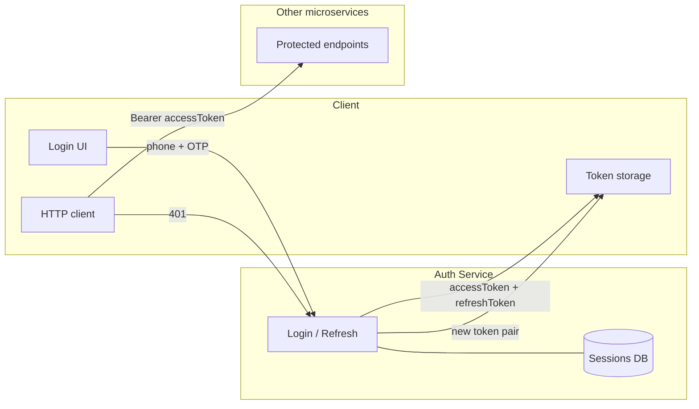
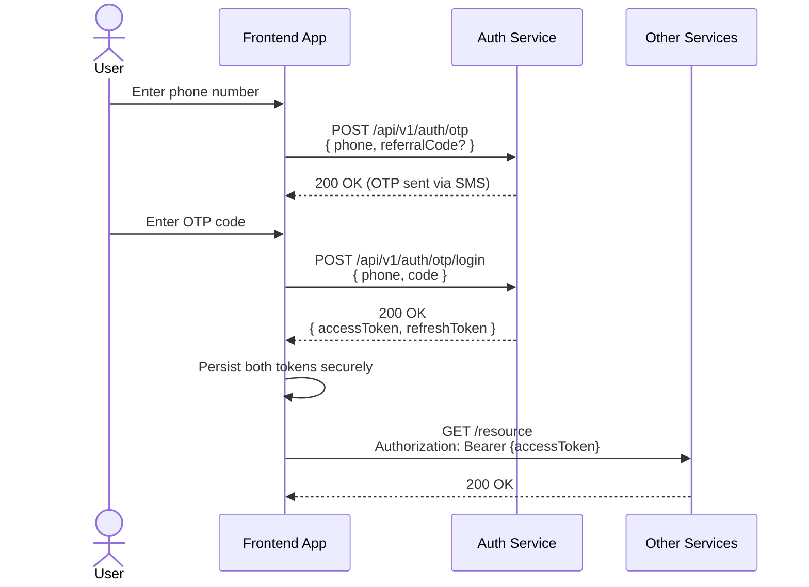
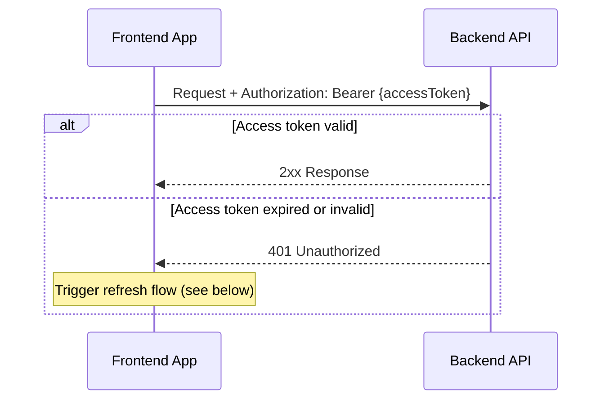
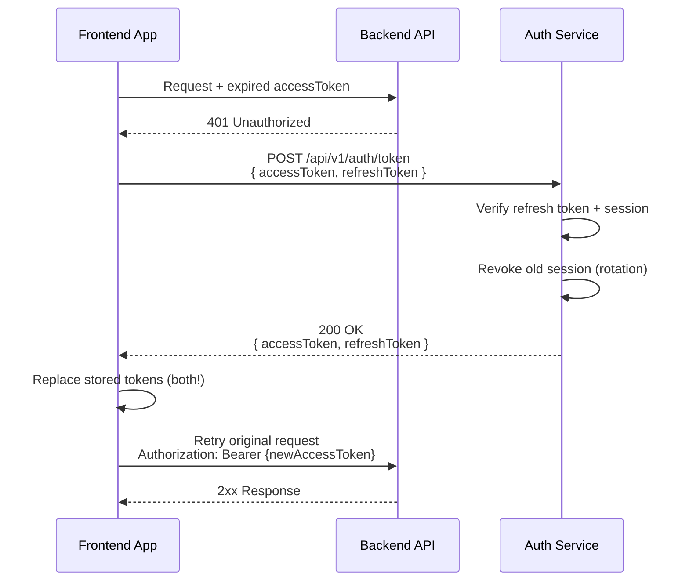
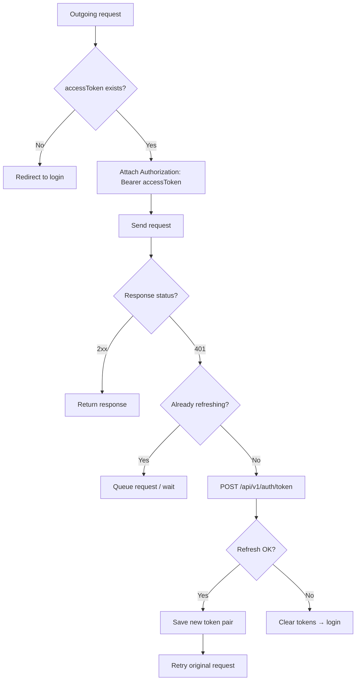
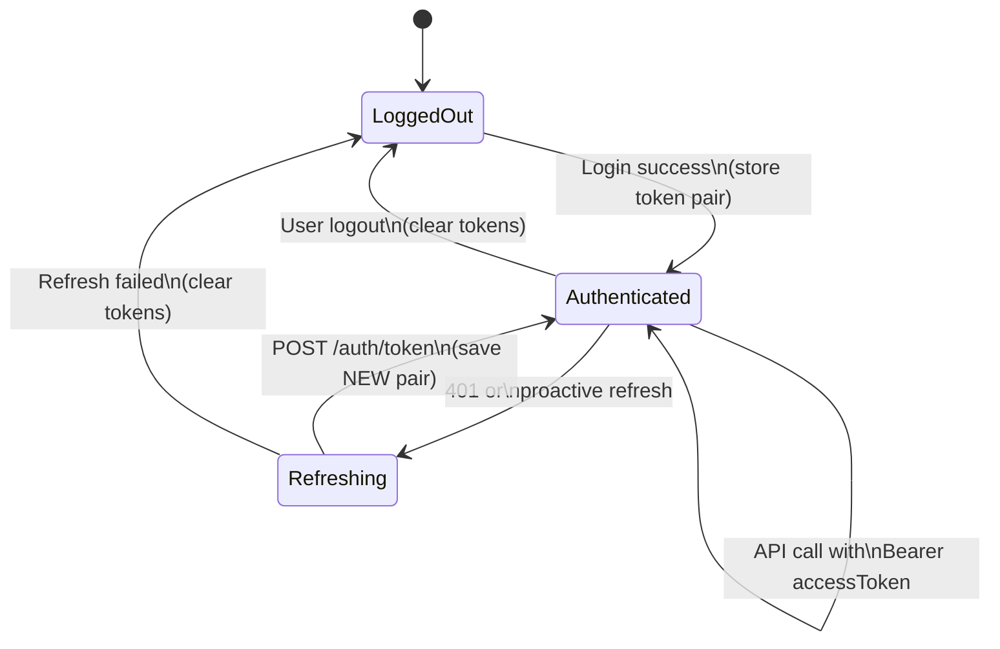

# Authorization Guide (Frontend)

This document describes how users are authenticated and authorized in our microservice platform. It is intended for frontend developers integrating with **Auth Service** and other backend APIs.

---

## Overview

Authentication uses **JWT** with two tokens:

| Token | Purpose | Lifetime (default) | Sent to APIs? |
|-------|---------|-------------------|---------------|
| **Access token** | Authorize API requests | **15 minutes** | Yes — `Authorization` header |
| **Refresh token** | Obtain a new token pair when the access token expires | **30 days** | No — only sent to Auth Service refresh endpoint |

Both tokens are signed with **RS256** (RSA + SHA-256). Access and refresh tokens use **separate RSA key pairs**, so they cannot be interchanged.



---

## Token format

Each token is a standard JWT string: `header.payload.signature`.

### Claims (payload)

| Claim | Description |
|-------|-------------|
| `sub` | User ID (UUID) — use this as the authenticated user identifier |
| `iat` | Issued-at timestamp (Unix seconds) |
| `exp` | Expiration timestamp (Unix seconds) |
| `kid` (header) | Key ID — `auth-access` for access tokens, `auth-refresh` for refresh tokens |

Example decoded access token (for debugging only — **do not trust decoded data without server verification**):

```json
{
  "sub": "550e8400-e29b-41d4-a716-446655440000",
  "iat": 1716631200,
  "exp": 1716632100
}
```

Other services verify access tokens using the public key published at:

`GET /.well-known/jwks.json`

(Frontend apps normally **do not** need to call JWKS; they only store and forward tokens.)

---

## End-to-end flows

### 1. Login (obtain tokens)



**Steps**

1. Request OTP: `POST /api/v1/auth/otp`
2. Submit phone + OTP: `POST /api/v1/auth/otp/login`
3. On success, store **both** `accessToken` and `refreshToken`
4. Use `accessToken` for all subsequent API calls

---

### 2. Authenticated API requests

Every request to a protected endpoint must include the access token:

```http
Authorization: Bearer <accessToken>
```



**Rules**

- Send only the **access token** in the `Authorization` header (never the refresh token).
- Use the `Bearer` scheme exactly: `Authorization: Bearer eyJhbG...`
- A **401** from any service usually means the access token is missing, expired, or invalid → refresh tokens before retrying.

---

### 3. Token refresh (after 401 or proactive renewal)

When the access token expires (~15 minutes), APIs return **401**. The client must call Auth Service to get a **new token pair**.



**Important: refresh token rotation**

Each successful refresh:

1. **Revokes** the previous session on the server
2. Issues a **brand-new** `accessToken` **and** `refreshToken`

You **must** replace both stored tokens after every refresh. Reusing an old refresh token returns **401** (`INVALID_REFRESH_TOKEN` / `SESSION_REVOKED`).

---

## Auth Service API reference

Base URL: your deployed Auth Service origin (e.g. `https://auth.example.com`).

| Action | Method | Path | Auth required |
|--------|--------|------|---------------|
| Request OTP | `POST` | `/api/v1/auth/otp` | No |
| Login with OTP | `POST` | `/api/v1/auth/otp/login` | No |
| Refresh tokens | `POST` | `/api/v1/auth/token` | No (body carries tokens) |
| JWKS (public keys) | `GET` | `/.well-known/jwks.json` | No |

### Request OTP

```http
POST /api/v1/auth/otp
Content-Type: application/json
```

```json
{
  "phone": "09123456789",
  "referralCode": "optional-string"
}
```

Response: `200` with empty body (OTP sent via SMS).

---

### Login

```http
POST /api/v1/auth/otp/login
Content-Type: application/json
```

```json
{
  "phone": "09123456789",
  "code": "123456"
}
```

**Success — `200 OK`**

```json
{
  "accessToken": "eyJhbGciOiJSUzI1NiIsInR5cCI6IkpXVCIsImtpZCI6ImF1dGgtYWNjZXNzIn0...",
  "refreshToken": "eyJhbGciOiJSUzI1NiIsInR5cCI6IkpXVCIsImtpZCI6ImF1dGgtcmVmcmVzaCJ9..."
}
```

**Common errors**

| Status | Meaning | Client action |
|--------|---------|---------------|
| `401` | Invalid or expired OTP | Show error; let user request a new OTP |
| `404` | User not found locally | Rare after OTP flow; show support message |

---

### Refresh tokens

```http
POST /api/v1/auth/token
Content-Type: application/json
```

```json
{
  "accessToken": "<current-access-token>",
  "refreshToken": "<current-refresh-token>"
}
```

> **Note:** Both tokens are required in the body, even if the access token is already expired. The server primarily validates the refresh token and its session.

**Success — `200 OK`**

```json
{
  "accessToken": "<new-access-token>",
  "refreshToken": "<new-refresh-token>"
}
```

**Common errors — treat as “logged out”**

| Status | Error (typical) | Meaning |
|--------|-----------------|---------|
| `401` | Invalid or expired refresh token | Refresh JWT invalid |
| `401` | Refresh token not found or already revoked | Token reused after rotation, or session revoked |
| `401` | Session has been revoked | User logged out server-side / security rotation |
| `401` | Session has expired | Refresh session older than 30 days |

On any of these: **clear stored tokens** and redirect the user to login.

---

## Frontend implementation checklist

### Token storage

| Do | Don't |
|----|-------|
| Store `accessToken` and `refreshToken` in secure storage (httpOnly cookie if BFF exists; otherwise `localStorage` / secure mobile storage per platform guidelines) | Send `refreshToken` to non-auth APIs |
| Update **both** tokens after login and after every refresh | Keep using an old refresh token after a successful refresh |
| Clear both tokens on logout or unrecoverable 401 from refresh | Log or expose tokens in analytics / crash reports |

### HTTP interceptor pattern (recommended)



**Concurrent 401 handling**

If multiple requests fail with 401 at the same time, run **only one** refresh call and queue the others until it completes. Without this, parallel refreshes can invalidate each other's refresh tokens (rotation race).

**Proactive refresh (optional UX improvement)**

Decode `exp` from the access token (no signature verification needed for timing only) and refresh **~1 minute before expiry** to avoid visible 401 flashes.

### Logout

There is no dedicated logout endpoint in the current flow. To log out locally:

1. Delete `accessToken` and `refreshToken` from client storage
2. Redirect to the login screen

Server-side sessions remain until they expire or are rotated; for full server revocation, a future logout API may be added.

---

## Quick reference diagram (full lifecycle)



---

## Summary for frontend

1. **Login** → `POST /api/v1/auth/otp/login` → save `accessToken` + `refreshToken`.
2. **Every API call** → `Authorization: Bearer <accessToken>`.
3. **Access token TTL** → 15 minutes; expect **401** when expired.
4. **On 401** → `POST /api/v1/auth/token` with **both** current tokens → save the **new pair** → retry the failed request.
5. **Refresh rotation** → old refresh token becomes invalid immediately after a successful refresh.
6. **Refresh failure (401)** → clear tokens and send user to login.

For backend implementation details (sessions, Kafka, database), see Auth Service internal docs.
